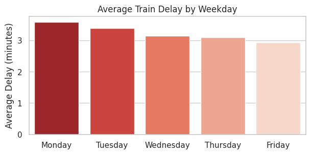

# Railway Delay Analysis - Tübingen (Germany)
*Data-driven insights into railway punctuality, delay risk, and passenger experience in the German railway network (Deutsche Bahn).*

**Dataset**: 12 months of railway operations (24,760 records)  
**Techniques**: EDA, hypothesis testing, Random Forest models  
**Key Result**: 82% accuracy in predicting critical delays

**Project Series**: This project is the first stage of a two-part analysis of railway delays at Tübingen Central Station (Hauptbahnhof). The second project focuses on advanced machine learning models and explainability techniques.
[View the next project](https://github.com/Vanessa22400/Railway_Delay_Advanced_Analysis_DB
)

---

## Business Context

Reliable public transportation is essential in Germany, especially for commuters and students. Even small disruptions can affect productivity and passenger trust.

While living in the Tübingen region (Baden-Württemberg), I experienced frequent delays that were constantly discussed among passengers. However, official numbers often summarize performance using averages, which can hide daily friction and rare high-impact events.

This project uses one year of operational data from Tübingen Centra Station to quantify delay patterns and translate passenger perception into actionable insights.

---

## Dataset

Source: Deutsche Bahn Railway Data  
https://huggingface.co/datasets/piebro/deutsche-bahn-data

The original dataset contains **millions of train operation records across Germany**.

A Python streaming approach was used to extract only **12 months of data** (Aug 2024 - Jul 2025) for **Tübingen Hbf** (24,760 records). 

---

## Problem Statement

How reliable is the railway service at Tübingen Hbf, and which operational factors are most associated with delays and higher delay risk?

This problem is approached through two predictive tasks:
- Regression: estimating delay duration (in minutes)
- Classification: predicting the probability of critical delays (>5 minutes)

---

## Objectives

- Identify key drivers behind delay patterns and delay risk
- Perform structured exploratory data analysis (EDA)
- Validate common commuter perceptions using hypothesis testing
- Engineer features aligned with operational context
- Build and evaluate predictive models (regression and classification)
- Translate findings into actionable insights for planning and communication

---

## Methodology

1. **Data Cleaning and Preprocessing**
2. **Exploratory Data Analysis (EDA)**
3. **Hypothesis Testing**
4. **Feature Engineering** (temporal, operational, and spatial features)
5. **Predictive Modelling** (regression and classification)
6. **Insight Generation**

---

## Tools & Technologies

- Python (Pandas, NumPy)
- Scikit-learn
- SciPy (Hypothesis Testing)
- Statsmodels (Time Series Decomposition)
- Matplotlib, Seaborn
- Folium (Geospatial Visualization)
- Data Source: Deutsche Bahn data (Hugging Face public repository)
- Modeling: Random Forest Regressor, Random Forest Classifier

---

## Exploratory Data Analysis Highlights

The exploratory analysis revealed consistent patterns with direct operational implications:

- **Perception gap:** 67.6% of services had some delay, even though the average delay was 3.23 minutes. This helps explain why everyday experience can feel worse than summary statistics.
- **Tail risk:** delays are mostly small, but the distribution is strongly right-skewed (extreme events up to 331 minutes). Severe delays above 30 minutes represent 1.24% of delayed services, but drive disproportionate disruption.
- **Monday fragility:** Mondays show the highest average delays and the highest concentration of cancellations, indicating a structurally more vulnerable start of the week.
- **Service differences:** express services have higher average delays than regional services (longer routes, exposure to network-wide disruptions).
- **Directional bottlenecks:** several southern and southeastern routes show higher average delays, while major hubs like Stuttgart appear comparatively more stable.

These findings guided formal hypothesis testing and the modeling strategy.



**Figure**: Average delay by weekday: Mondays show consistently higher delays.

---

## Modeling Approach

This project uses two complementary predictive tasks aligned with practical decision needs:

**Regression Task**: Focused on estimating expected delay minutes under typical operating conditions. To avoid extreme values distorting minute-level prediction, outliers are excluded from the regression training set.

**Classification Task**: Focused on identifying higher-risk scenarios using a critical delay definition (delay above 5 minutes). This framing is more actionable for planning and passenger communication, and better reflects operational risk management.

Model choice prioritized **interpretability**, non-linear pattern capture, and alignment with real-world constraints.  
Random Forest was selected as a baseline model due to its robustness, ability to capture non-linear relationships, and minimal assumptions about the data.

---

## Model Performance

**Regression (Predicting Delay Minutes)**
- Mean Absolute Error (MAE): 3.20 minutes
- R² Score: -0.0426
 
The negative R² score indicates that the model was not able to explain variance better than a baseline mean prediction. This suggests that key drivers of extreme delays are not present in the dataset, such as weather conditions, infrastructure failures, or network-wide disruptions.  
While the MAE reflects reasonable performance for small delays, predicting exact delay duration remains inherently unstable in complex systems.

**Classification (Predicting Critical Delays > 5 minutes)**
- Accuracy: 0.82
- On-time precision (Class 0): 0.86
- Critical delay recall (Class 1): 0.27
 
The model is strong at confirming lower-risk situations (useful for passenger trust and baseline planning). Critical delays remain harder to capture due to unobserved drivers and the nature of rare disruptions. This is a data limitation more than a modeling limitation, and it is a realistic finding for operational systems.  
This limitation reflects the intrinsic difficulty of predicting rare, high-impact events in complex systems.
From a business perspective, the model remains valuable for identifying low-risk scenarios with high confidence, supporting planning and improving passenger communication.


*Feature Importante: 'month' is the most predictive factor of a critical delay.*  
Feature importance analysis indicates that month, day_of_week, and destination are the most relevant predictors, reinforcing the importance of seasonal patterns and structural route constraints.

---

## Key Insights

- Summary metrics can be misleading: the average delay looks moderate, but the majority of services experience some delay, which matches passenger perception.
- **Mondays are consistently riskier:** both delay averages and cancellations peak early in the week, suggesting lower operational resilience.
- **Rush hour amplifies disruption:** overall mean delay rises during peak times (3.83 vs. 2.77 minutes), and delayed services are more severe during rush hour (5.20 vs. 4.39 minutes).
- Delay risk is more seasonal than hourly: month and weekday patterns carry more signal than the departure hour alone.
- Reliability is not evenly distributed: certain directions and destinations show recurring bottlenecks, suggesting localized infrastructure constraints.

---

## Business Impact & Applications

**Operational optimization**  
Support targeted actions on high-risk days and periods, especially early-week operations.

**Resource allocation**  
Improve staffing, maintenance planning and contingency readiness where risk concentrates (weekday patterns, seasonal peaks, and bottleneck routes).

**Risk mitigation**  
Use risk-based classification outputs to flag likely critical delays and reduce cascading effects.

**Strategic planning**  
Identify structural vulnerabilities (seasonality, destination-level risk) to inform longer-term network improvements.

**KPI monitoring**  
Track stability beyond averages, using metrics such as delay incidence, cancellation rate, and critical delay risk rate over time.

---

## Limitations

• The dataset focuses on a single station (Tübingen Hbf), which may limit generalization to the entire German railway network.

• External factors such as weather conditions or infrastructure disruptions are not included in the dataset.

• Rare extreme delays may be influenced by irregular operational events that are difficult to capture with historical data.

---

## Next Steps

- Integrate weather variables to quantify seasonal effects and improve critical-delay detection
- Merge maintenance and construction logs (Baustellen) to separate planned vs. unexpected disruption
- Test alternative models (boosting methods) and add explainability for stakeholder communication
- Build a lightweight API for delay-risk alerts
- Create a dashboard for monitoring weekday and route-level reliability trends

---
## Repository Structure

```
.
├── data
├── notebooks
├── images
├── requirements.txt
└── README.md
```
---

## Strategic Perspective 
I intentionally framed this project around the gap between what passengers feel and what official averages show. Instead of assuming perfect predictability, I tested where prediction breaks, why it breaks, and what can still be useful for decision-making.

Living in different countries shaped how I approach analysis: I tend to question assumptions, pay attention to context, and connect patterns to real operational constraints. This project reflects that approach by combining technical modeling with practical interpretation and clear limitations.

---
## Next Project in the Series

This analysis continues in the following project:

**Railway Delay Modeling & Explainability - Tübingen (Germany)**  
Advanced machine learning models and SHAP explainability applied to the same dataset to better understand delay drivers and predictive performance.

---

## Conclusion

This project turns everyday commuter experience in Baden-Württemberg into a structured end-to-end analysis of railway reliability at Tübingen Hbf.

The results validate patterns passengers often discuss, quantify where risk concentrates, and show why predicting exact delay minutes is limited in complex networks. A risk-based approach provides more actionable value for planning, communication and monitoring.

A key takeaway is that in complex systems, understanding the limits of prediction can be as valuable as prediction itself.

---


